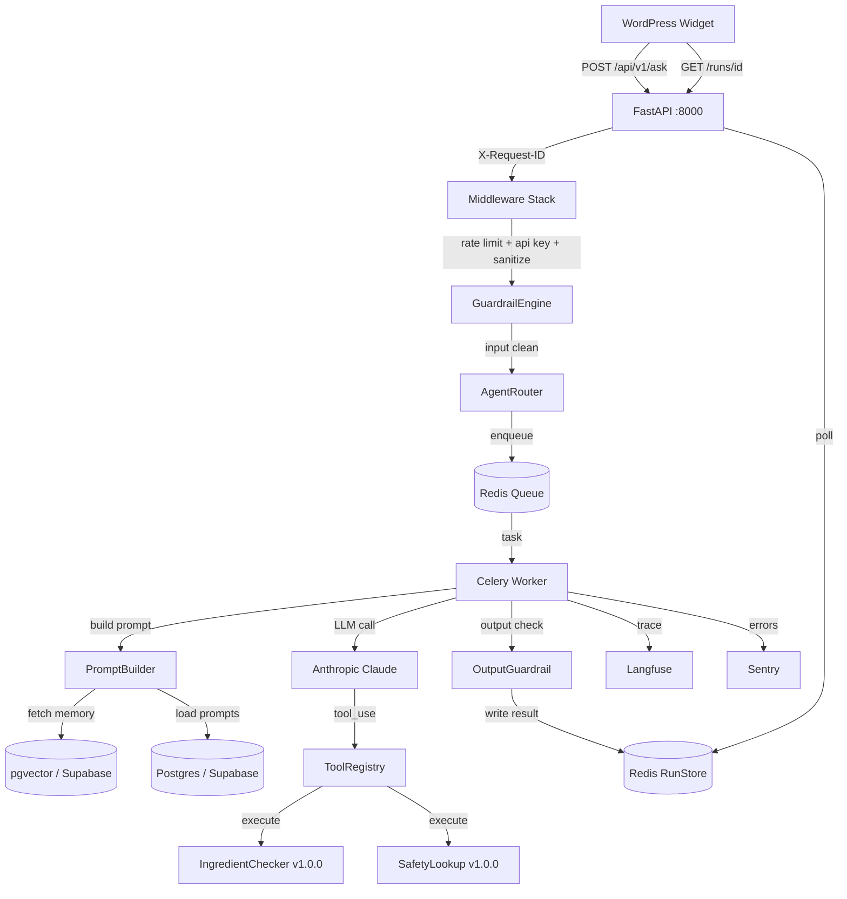

# LLM Agent Framework

[](https://github.com/{username}/llm-agent-framework/actions/workflows/ci.yml)
[](https://codecov.io/gh/{username}/llm-agent-framework)


**A generic, config-driven, production-ready LLM agent framework with async job processing, multi-agent routing, tool versioning, and full observability.**

## Architecture



## Key Engineering Decisions

- **Async jobs (Celery)** — POST /ask returns in <50ms with a run_id; client polls for results. Production-grade pattern for LLM workloads.
- **Generic router** — AgentRouter protocol with ConfigRouter implementation. Add agents via config, not code changes.
- **Tool versioning** — Every tool carries a semver string, logged as `name@version`. Enables audit trails and rollback decisions.
- **pgvector memory** — Semantic search over conversation history for contextual responses.
- **Config-driven guardrails** — Injection and forbidden output patterns injected via env vars. No domain logic in framework code.

## Local Dev Setup

```bash
git clone git@github.com:{username}/llm-agent-framework.git
cd llm-agent-framework
cp .env.example .env && cp agents/nalla/nalla.env.example .env.nalla
# Edit .env — fill ANTHROPIC_API_KEY, DATABASE_URL, WIDGET_API_KEY
uv sync
docker compose -f docker-compose.dev.yml up
# API running at http://localhost:8000/api/v1/health
```

## Running Tests

```bash
uv run ruff check .
uv run ruff format --check .
uv run mypy src/
uv run pytest tests/unit/ tests/integration/ --cov=src --cov-fail-under=85
```

## Adding a New Domain

1. Create `agents/{name}/tools/` with tool implementations
2. Create `agents/{name}/nalla.env.example` with domain-specific env overrides
3. Create `agents/{name}/seeds/prompts.json` with system prompts
4. Create `agents/{name}/router_config.json` with routing rules

## API Reference

| Method | Endpoint | Auth | Response |
|--------|----------|------|----------|
| POST | `/api/v1/ask` | X-API-Key | 202 `{ run_id, status_url }` |
| GET | `/api/v1/runs/{run_id}` | X-API-Key | 200 `RunStatusResponse` |
| GET | `/api/v1/runs/{run_id}/stream` | X-API-Key | SSE token stream |
| GET | `/api/v1/health` | None | 200 `HealthResponse` |
| GET | `/api/v1/admin/prompts` | X-Admin-Key | 200 `list[Prompt]` |
| PUT | `/api/v1/admin/prompts/{key}` | X-Admin-Key | 200 `Prompt` |

## Environment Variables

See [`.env.example`](.env.example) for all configuration options with descriptions.
